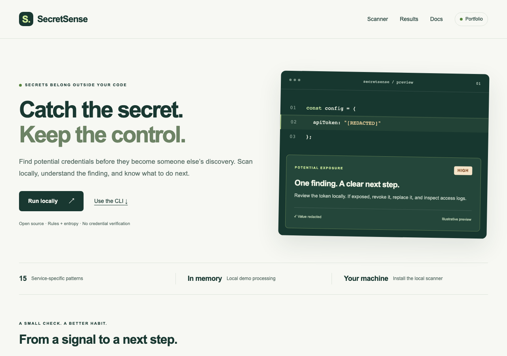

# SecretSense

Find potential secrets in local source code without sending it to a remote service.

SecretSense is a Python secret scanner with a working CLI, redacted console,
JSON, HTML, and SARIF reports, service-specific patterns, and entropy checks. Optional
local ML adds experimental scores without removing findings. A bounded FastAPI service
and a Next.js demonstration site run locally.

[](https://github.com/yassineeljal/SecretSense/actions/workflows/ci.yml)
[MIT license](LICENSE) · Python 3.11+ · Local scanning

**Status:** sprints 0–6 are implemented and pushed. Sprint 7 adds six informational
pages, interactive recorded benchmarks, privacy policy, portfolio hosting
configuration, and release preparation. Public hosting and PyPI publication remain
pending. Rules plus entropy remain the default; optional ML retains every finding.
The full intended product is described in [the roadmap](docs/roadmap.md).



[Animated site preview](docs/assets/site-preview.gif) — three captured views of the
home, pipeline, and recorded benchmarks; no scan input or real credentials.

## Session handoff

Read this README, `AGENTS.md`, and [the progress log](docs/progress.md) before work.

- **Current milestone:** sprints 0–6 delivered; sprint 7 site/policy/release
  preparation implemented. The public deployment/publication milestone is pending.
- **Latest implementation:** how-it-works, benchmarks, docs, model, security, and
  about pages; evidence-driven benchmark selection and confusion matrices; command
  copying; portfolio mode with scanning disabled; Vercel configuration; manual
  build/TestPyPI/PyPI workflow with guarded publication; package metadata/license.
- **Measured limitation:** no new ML experiment. The historical filter loses
  recall, the fresh forest/XGBoost filters tie, and both observed synthetic
  holdouts must not become tuning data. See [the model card](docs/model-card.md).
- **Verified locally:** 147 Python/API tests (92.79% coverage), 18 desktop/mobile
  local-site checks, and two portfolio checks. Ruff, web lint/format/type/build,
  package build/Twine validation, and dependency audits pass. Desktop/mobile
  benchmark layouts were visually inspected. See [progress](docs/progress.md).
- **Remote checks:** implementation `5a9024d` is pushed to `origin/main` and
  [CI passed](https://github.com/yassineeljal/SecretSense/actions/runs/36950882794)
  on Python 3.11–3.14, hooks, Action smoke, and Node 24 browser/build/audit jobs.
  The [build-only release rehearsal passed](https://github.com/yassineeljal/SecretSense/actions/runs/36950893726),
  producing wheel/sdist artifacts; publication was skipped. The runner setuptools
  audit failure from checkpoint `9e78ab0` is fixed. No deployment/publication occurred.
- **Next concrete step:** configure an owner-selected portfolio host and
  TestPyPI/PyPI projects following [the release guide](docs/release.md), review
  host privacy/logging, then verify deployment and publication. Public scanning
  first needs authentication, TLS/ingress/logging review, and shared limits.
- **Local preview:** local mode is rebuilt and serving at `http://127.0.0.1:3000`,
  with the bounded single-worker API on port 8000. These are local review servers.
- **Still planned:** public launch, package publication, supplied biography/profile
  links, independent review, unseen-repository evaluation, calibration, repository
  URL input, and optional Ollama. Host/project ownership and privacy contact are
  not supplied; do not infer them from the Git remote.
- **Standing instructions:** English project content; keep this handoff and relevant
  guides current; keep scanning local; never commit real credentials or invent metrics.

## Quick start

Requires Python 3.11 or newer. Run from this repository's root:

```sh
python3 -m venv .venv
source .venv/bin/activate
python -m pip install -e './core[dev]'
secretsense scan ./my-project
```

```sh
secretsense scan ./my-project --format json
secretsense scan ./my-project --format html > ../scan-report.html
secretsense scan ./my-project/.env
```

Exit codes: `0` no candidates, `1` candidates found, `2` invalid input or an
incomplete scan. Reports always mask detected values. Nothing is uploaded and
scanned contents are not written to disk by the scanner.

## Local browser demo

Install `./core[api]`, start the loopback API, and run the site from `web/`:

```sh
python -m pip install -e './core[api]'
python -m uvicorn api.main:app --host 127.0.0.1 --workers 1 --no-access-log --no-proxy-headers --limit-concurrency 16 --backlog 32 --timeout-keep-alive 5
```

In a second terminal:

```sh
cd web
npm ci
npm run build
npm run start
```

Open `http://127.0.0.1:3000`. The site sends input only to the API on your machine;
results stay in browser memory. Input clears at submission. Requests are limited
to 1 MiB, two concurrent scans, and 30 POSTs/minute. See the
[API/site guide](docs/api-and-web.md) for full limits, privacy, and validation.
This is a local demonstration; no hosted service is available.

## What works

- Local UTF-8 file and directory scanning with nested `.gitignore` rules.
- Patterns for 15 services, plus JWTs and private-key headers.
- Entropy checks for literals assigned to secret-like variable names.
- Masked findings with file locations, rule IDs, severity, and explanations.
- Bounded file reads and traversal, with explicit incomplete-scan errors.
- Python library entry points and redacted console, JSON 1.2, HTML, and SARIF reports.
- Service remediation playbooks and bounded local Git-history scans with commit/blob provenance.
- A reusable GitHub Action with local SARIF output and explicit incomplete-scan failures.
- Optional local model annotations with trusted checksums; all findings remain visible.
- Bounded local FastAPI text scans, health checks, and active-engine information.
- Responsive Next.js home/scan/results, file input, severity filters, and remediation.
- Six informational pages, interactive recorded benchmarks, and a portfolio build
  that accepts no scan input; hosting and release workflow configuration.
- Unit, CLI, API, and browser tests; Python/web CI, dependency auditing, and Gitleaks hooks.
- Deterministic synthetic-data generation, reviewed negative-template rationale,
  a 6,000-row balanced local CSV, grouped train/validation/test splits, and exploration.
- Fresh candidate-negative forest/XGBoost comparisons and aggregate-only error analysis.
- Offline random-forest training, validation-only selection, trusted local artifacts,
  candidate-coverage analysis, measured synthetic model comparisons, and exported figures.

The scanner skips symlinks, binary/non-UTF-8 input, oversized files, and common
build/dependency directories. Ignored files can contain secrets: explicitly scan
files such as `.env` when needed. A clean report is not a security guarantee.
See [detection coverage and limitations](docs/detection.md).

## Repository

```text
core/                 Python package, CLI, scanner, reports, and tests
ml/                   Synthetic data, training, aggregate results, notebooks, tests
api/                  Bounded local FastAPI service, disposable worker, API tests
web/                  Next.js demonstration and Playwright browser tests
.github/              CI workflow and Dependabot configuration
docs/                 Architecture, roadmap, usage, security, and progress
```

The API and site run from the checkout; only the core scanner is packaged in the wheel.

Generate the local dataset with `python -m ml.scripts.build_dataset` from the
repository root. See [the dataset guide](ml/README.md) for reproduction, schema,
split policy, and limitations. Labels describe invented examples, not verified
credentials; synthetic data does not establish real-world model performance.

## Documentation

- [Local API and website](docs/api-and-web.md)
- [Hosting and release preparation](docs/release.md), [changelog](CHANGELOG.md), and
  [privacy policy](PRIVACY.md)
- [CLI and library usage](docs/cli.md)
- [Detection rules](docs/detection.md) and [remediation playbooks](docs/remediation.md)
- [GitHub Action integration](docs/github-action.md)
- [Architecture](docs/architecture.md)
- [Full project roadmap](docs/roadmap.md)
- [Dataset generation and exploration](ml/README.md)
- [Progress and validation log](docs/progress.md)
- [Model card](docs/model-card.md) and [benchmark plan](docs/benchmarks.md)
- [Threat model](docs/threat-model.md) and [security policy](SECURITY.md)
- [Contribution guide](CONTRIBUTING.md)

All code, comments, documentation, and user-facing text are maintained in English.
Every meaningful change must update this README's session handoff; functional
changes must also update the relevant documentation and progress log.

## Development

After the quick-start installation, add optional ML, experiment, and plotting dependencies
for the full suite. macOS XGBoost experiments also need `brew install libomp`:

```sh
python -m pip install -e './core[dev,ml,plots,experiments,api]'
pre-commit install
ruff check core ml api .github/actions-runner
ruff format --check core ml api .github/actions-runner
pytest core/tests ml/tests api/tests --cov=secretsense --cov=ml.scripts --cov=api --cov-report=term-missing --cov-fail-under=85
python -m ml.scripts.build_dataset
python -m build core
pip-audit --skip-editable
```

Remote CI results are available only after changes are pushed. See the progress
log for checks actually run locally.

Licensed under the [MIT License](LICENSE).
