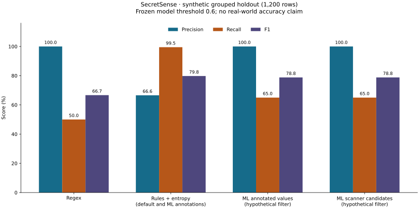
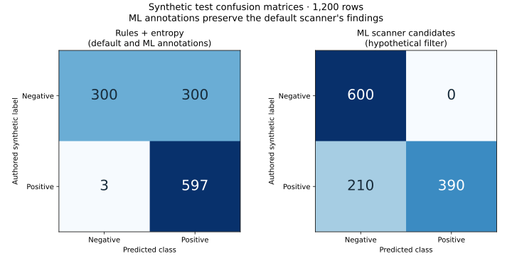

# Benchmarks

Sprint 3 supplies a measured **synthetic grouped-holdout experiment**, not a
real-world detection-quality claim. Unit-test pass rates are separate software
validation. The [aggregate run report](../ml/results/baseline.json) contains the
complete train/validation/test metrics, candidate coverage, per-family confusion
matrices, feature importances, selection trials, source hashes, and environment.

## Recorded test comparison

Run date: 2026-09-30. Dataset: 6,000 synthetic examples; train/validation/test sizes
3,600/1,200/1,200, balanced within each split. Entire source/template families are
held out. The test families are database passwords, Stripe shapes, documentation
URLs, and test dummies (300 each). All rows contribute to every method's metrics.
Confusion matrices use actual rows and predicted columns in class order [0, 1].

| Method | Precision | Recall | F1 | TN / FP / FN / TP |
| --- | ---: | ---: | ---: | --- |
| Regex alone | 100.00% | 50.00% | 66.67% | 600 / 0 / 300 / 300 |
| Rules plus entropy | 66.56% | 99.50% | 79.76% | 300 / 300 / 3 / 597 |
| ML on annotated values | 100.00% | 65.00% | 78.79% | 600 / 0 / 210 / 390 |
| ML on scanner candidates | 100.00% | 65.00% | 78.79% | 600 / 0 / 210 / 390 |

Regex alone applies service/key/JWT formats. Rules plus entropy is the current
scanner. Annotated-value ML assumes a supplied value boundary for every row.
Candidate-pipeline ML uses actual scanner spans; a row is positive if any candidate
scores at least 0.6, and rows without candidates are negative. That pipeline is an
experiment in hypothetical filtering. Sprint 4 CLI ML mode annotates all findings,
so its retained-finding metrics are those of rules plus entropy. The two ML filter
results coincide on this test set; their inputs and interpretation differ.

## Candidate coverage and interpretation

| Split | Positive rows extracted / total | Negative rows extracted / total |
| --- | ---: | ---: |
| Train | 1,800 / 1,800 | 0 / 1,800 |
| Validation | 600 / 600 | 0 / 600 |
| Test | 597 / 600 | 300 / 600 |

Candidate-only binary training is impossible with the current training split.
Using all annotated negatives permits a baseline but introduces a population
mismatch. Validation cannot measure suppression of candidate false positives.
The selected forest rejects all synthetic test dummies, yet also rejects 210/300
invented database passwords. Three of those passwords are already missed by
candidate extraction. This does **not** justify enabling ML as the default filter.

Selection uses validation F2 (recall weighted more than precision), then recall,
precision, and closeness to 0.5, across 15 fixed parameter/threshold combinations.
The reserved test set is evaluated after selection and artifact creation. Test
results have not been used to retune the model. A subsequent quality experiment
needs fresh held-out groups; rerunning the same experiment is only reproduction.

The recorded local run took approximately 0.37 seconds through fit/selection and
0.81 seconds overall on Darwin arm64, Python 3.12.13. These are single-run wall-clock
observations, not a latency benchmark or comparison of inference speeds. Exact
dependency versions, source hashes, dirty Git state, and dataset/artifact checksums
are in the report. There is no remote CI, deployment, or publication claim.

Run the [model-comparison notebook](../ml/notebooks/03_model_comparison.ipynb) after
following the [training guide](../ml/README.md#baseline-training-and-evaluation).
It reads aggregate results without retraining or printing values. The sprint 5
XGBoost comparison is recorded below. Optional LLM, unseen-repository evaluation,
calibration, and independent human review remain planned.

## Sprint 4 integration reproduction and figures

The [integration report](../ml/results/integration.json) checks the frozen model
through `scan_text` on the same 1,200 already-observed test rows, without fitting or
tuning. Every scored finding, after removing score fields, equals its rules-only
counterpart. All **897 candidates** remain visible: 390 at or above 0.6 and 507
below it. Retained-finding precision/recall/F1 remain 66.56%/99.50%/79.76%.
Hypothetical above-threshold filtering reproduces 100%/65%/78.79% exactly.

This is integration verification, not fresh model-quality evidence. The original
sprint 3 report and pickle are preserved, including their historical source
hashes and statements about the then-unintegrated CLI. The integration report
records current source hashes and the checksum of that historical report.

The figures read only aggregate sprint 3 results; they do not load credentials,
source contexts, or pickles. PNG copies are available beside the SVGs. Reproduce
using the [integration commands](../ml/README.md#integration-benchmark-and-figures).
The recorded export used Matplotlib 3.11.2. Font/layout rendering may differ across
environments; underlying metrics must remain unchanged.

## Sprint 5: fresh grouped candidate experiment

[Protocol](sprint5-experiment.md) and [aggregate evidence](../ml/results/xgboost.json)
are separate from the observed sprint 3/4 corpus. The new 2,400 examples include
both candidate labels in train/validation/test and use disjoint grouped contexts.
The default run checked exact value disjointness against all 6,000 historical rows.
This is authored synthetic data, not unseen real repositories or independently
adjudicated credential validity. Model selection was frozen before constructing
and evaluating the 600-row holdout; no holdout-based retuning occurred.

| Method on new holdout | Precision | Recall | F1 | TN / FP / FN / TP |
| --- | ---: | ---: | ---: | --- |
| Regex only | 50.00% | 66.67% | 57.14% | 100 / 200 / 100 / 200 |
| Rules plus entropy | 50.00% | 100.00% | 66.67% | 0 / 300 / 0 / 300 |
| Retrained forest filter | 54.55% | 100.00% | 70.59% | 50 / 250 / 0 / 300 |
| XGBoost filter | 54.55% | 100.00% | 70.59% | 50 / 250 / 0 / 300 |

The forest and XGBoost each reject the 50 dummy-prefixed integration-password
negatives, retaining the other 250 negatives and all 300 positives. The authored
provider-shaped fixtures and positive values have similar feature distributions;
shape cannot establish intent. XGBoost has no measured holdout advantage here.
Its validation selection missed one positive, versus zero for the selected forest;
this was not corrected using test results. Scores remain uncalibrated and the CLI
continues to retain **all** candidates. These metrics are not directly comparable
to the old test set because the population and groups differ.

Historical error analysis retains the baseline's 210 missed passwords (three
candidate-extraction misses plus 207 model rejections) and 300 rule false positives
on authored dummies. The [fourth notebook](../ml/notebooks/04_error_analysis.ipynb)
shows both experiments' aggregate family errors with no snippets or raw values.
Report provenance includes source/protocol/dataset/artifact checksums, environment,
all selection trials, coverage, confusion matrices, and single-run total time.
Time is informational, not a statistically established performance benchmark.
The observed new holdout must not become tuning data for the next experiment.

## Website explorer

The `/benchmarks` page imports the two aggregate reports above at build time.
Readers can switch experiments and inspect each method's precision/recall/F1 and
confusion matrix. Counts and percentages derive from the reports, not a separately
maintained metric copy. The page labels both populations synthetic, separates
filter experiments from retained CLI annotations, and links back to source evidence.
Browser checks compare every exposed method to the aggregate reports.
